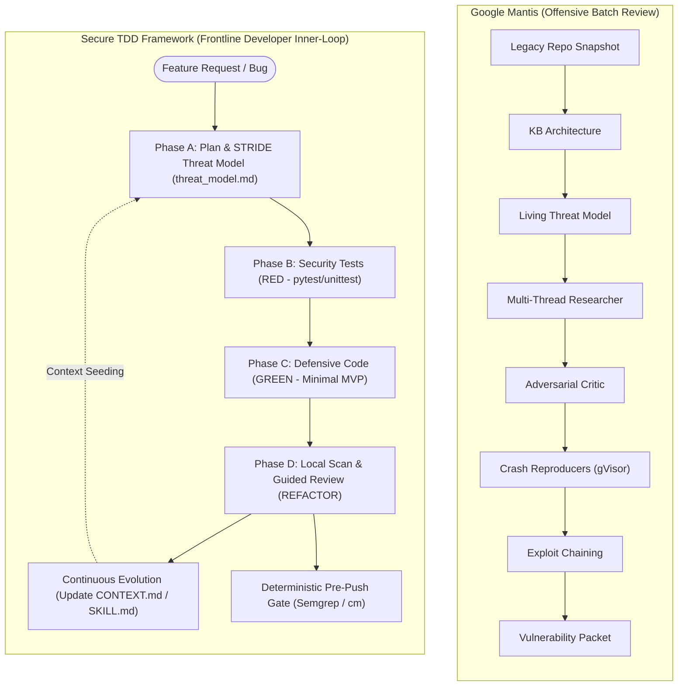

# Secure Test-Driven Development (Secure TDD) Agent Framework

> **A lightweight, proactive security orchestration framework for AI coding agents and solo developers.** Built around Test-Driven Development (TDD), living STRIDE threat modeling, local deterministic guardrails, and continuous skill self-evolution.

---

## 1. Executive Summary & Paradigm Shift

Traditional security models rely on post-merge CI/CD pipelines, causing a high "verification tax", delayed feedback loops (20–70 days to patch), and developer fatigue. Similarly, low-context AI coding agents generate large, unreviewable diffs with contextual naivety and subtle security flaws.

**Frontline Agentic Security** resolves these bottlenecks by shifting security directly into the AI coding agent's inner-loop:
1. **Proactive Boundary Enforcement**: Architectural boundaries and STRIDE threat models are generated *before* any production code is authored.
2. **Security Test-First (RED)**: Boundary constraints are codified into executable tests asserting HTTP 400/401/403 status codes and input validation rejections.
3. **Defensive Implementation (GREEN)**: Minimal defensive logic satisfies the assertions using allow-lists, parameterized queries, and least privilege.
4. **No Heavy Database Required**: All state is managed via plain Markdown (`CONTEXT.md`, `threat_model.md`) and append-only logs (`.security-gate/`).
5. **Continuous Skill Evolution**: When a bug or new pattern is resolved, the agent extracts the systemic lesson and dynamically updates `CONTEXT.md` and `SKILL.md` so the mistake is never repeated.

---

## 2. Architecture Comparison: `secure-coding-agy-config` vs `google/mantis` vs Secure TDD



### Mantis Skills Triage for Developer Workflows

| Mantis Skill (Review Focus) | Adapted Secure TDD Skill (Dev Focus) | Role in Developer Velocity |
| :--- | :--- | :--- |
| `mantis-threat-model` + `mantis-plan` | **Phase A: Threat Model Assessor** | Evaluates feature scope against STRIDE before code is written, creating `threat_model.md`. |
| `mantis-reproduce` | **Phase B: Security Test Writer (RED)** | Translates exploit reproduction into native unit/integration tests added to the test suite. |
| `mantis-patch` + `mantis-review` | **Phase C: Defensive Developer (GREEN)** | Implements minimal defensive logic (allow-lists, parameterized sinks) satisfying the tests. |
| `mantis-critic` + Deterministic SAST | **Phase D: Local Refactor & Scanner** | Fast, local diff checks (secrets, dependencies, Semgrep) + guided AI review before commit. |
| `mantis-reflect` | **Continuous Evolution: Skill Updater** | Extracts systemic lessons from fixes and updates `CONTEXT.md` / `SKILL.md` specs. |
| `mantis-history` | **History Context Seeder** | Mines VCS history during repository onboarding to seed `CONTEXT.md` with past lessons. |
| *`mantis-chain`, `mantis-calibrate`, `mantis-report`* | **EXCLUDED** | Dropped to maintain instant developer feedback and eliminate review latency. |

---

## 3. The Secure TDD Inner-Loop

```
                 +---------------------------+
                 |       PLAN & RED          |
                 |  - Ingest CONTEXT.md      |
                 |  - STRIDE Threat Model    |
                 |  - Security Tests (Red)   |
                 +-------------+-------------+
                               |
                               v
                 +---------------------------+
                 |         GREEN             |
                 |  - Defensive Code (MVP)   |
                 |  - Satisfy Red Tests      |
                 +-------------+-------------+
                               |
                               v
                 +---------------------------+
                 |     REFACTOR & SECURE     |
                 |  - Local Scans & Audits   |
                 |  - Surgical Small Diffs   |
                 |  - Evolve Skills/Specs    |
                 +-------------+-------------+
                               |
                               +--- Continuous Evolution ---+
```

### Phase-by-Phase Breakdown

#### Phase A: Proactive Planning & Threat Modeling (Plan Phase)
- **Core Skill**: `threat_model_assessor`
- Ingests `CONTEXT.md` to identify existing trust boundaries and approved helpers.
- Performs STRIDE evaluation (Spoofing, Tampering, Repudiation, Information Disclosure, Denial of Service, Elevation of Privilege).
- Generates/updates `threat_model.md` at the workspace root, defining Security Acceptance Criteria.

#### Phase B: Security Test-First Case Creation (Red Phase)
- **Core Skill**: `security_test_writer`
- Applies three verification pillars:
  1. *Behavior-driven outcomes*: Assert strictly on HTTP status codes (400, 401, 403) and responses.
  2. *Strict test isolation*: Fresh contexts and transaction rollbacks.
  3. *Integration over fragile mocking*: Local test instances instead of superficial fakes.
- Verifies that tests fail for the expected security constraint (RED).

#### Phase C: Secure Defensive Implementation (Green Phase)
- **Core Skill**: `defensive_developer`
- Implements the absolute minimum defensive logic to pass tests:
  1. *Simple input validation*: Strict allow-lists, typed schemas (`pydantic`).
  2. *Explicit authorization*: Validating caller identity before route execution.
  3. *Least privilege*: Returning minimal payload attributes and parameterizing SQL/commands.
- Confirms all tests pass (GREEN).

#### Phase D: Local Refactoring & Scanning (Refactor Phase)
- **Core Skill**: `local_refactor_scanner`
- Fast deterministic scans on the diff (secrets, dependency CVEs, local Semgrep).
- Guided AI review for design flaws, logic bypasses, and dead code.
- Ensures small, surgical diffs and zero regressions across the test suite.

#### Continuous Evolution: Updating Skills & Context
- **Core Skill**: `skill_evolution_updater`
- Extracts the systemic rule from newly applied fixes (e.g., *"Always use `utils.security.safe_redirect()`"*).
- Automatically appends new conventions to `CONTEXT.md` and refines `SKILL.md` prompt instructions.

---

## 4. Repository Structure & Multi-Agent Compatibility

The repository is organized to support **Antigravity**, **Claude Code**, and **Universal Agents** simultaneously:

```none
secure-tdd-agent-framework/
├── CONTEXT.md                         # Living project context, boundaries & evolved rules
├── threat_model.md                    # Living STRIDE threat model artifact
├── AGENTS.md                          # Universal agent guidelines & inner-loop spec
├── CLAUDE.md                          # Claude Code always-on workflow instructions
├── requirements.txt                   # Framework dependencies
├── .agents/                           # Antigravity Workspace Config (Auto-discovered)
│   ├── rules/
│   │   └── secure_tdd_workflow.md    # Always-on workflow rule (Plan -> Red -> Green -> Refactor)
│   ├── skills/
│   │   ├── threat_model_assessor/
│   │   ├── security_test_writer/
│   │   ├── defensive_developer/
│   │   ├── local_refactor_scanner/
│   │   ├── skill_evolution_updater/
│   │   └── history_context_seeder/
│   ├── hooks.json                     # Pre-push hook (CodeMender / Semgrep)
│   ├── security_gate_hook.sh          # CodeMender security hook script
│   ├── security_gate_hook_semgrep.sh  # Semgrep security hook script
│   ├── lib/gate_common.sh             # Common severity ranking & audit logger
│   └── tests/                         # Offline hook test suite (26/26 mock tests)
├── claude-code/                       # Claude Code Portable Port
│   ├── CLAUDE.md
│   └── .claude/
│       ├── settings.json              # Claude Code hooks & permissions
│       ├── hooks/                     # PreToolUse bash push interceptors
│       └── skills/                    # Kebab-case Claude Code skills
├── sample_app/                        # Sample application demonstrating Secure TDD
│   ├── app.py                         # Flask service with defensive endpoints
│   └── utils/security.py              # Approved security helpers (paths, redirects, SQL)
└── tests/
    └── test_sample_app.py             # Integration test suite asserting security boundaries
```

---

## 5. Quickstart & Installation

### Option 1: Using with Antigravity
The `.agents/` folder at the root of this repository is already configured.
1. Ensure `semgrep` or `cm` is installed on your `PATH`:
   ```bash
   pip install semgrep
   ```
2. Activate the Semgrep hook (or keep default CodeMender):
   ```bash
   cp .agents/hooks_semgrep.json .agents/hooks.json
   ```
3. Start coding! Antigravity will automatically follow the `secure_tdd_workflow.md` rule on all tasks.

### Option 2: Using with Claude Code
1. Copy `claude-code/CLAUDE.md` and `claude-code/.claude/` to your workspace root:
   ```bash
   cp claude-code/CLAUDE.md ./
   cp -r claude-code/.claude ./
   ```
2. If using Semgrep, activate the Semgrep settings:
   ```bash
   cp .claude/settings.semgrep.json .claude/settings.json
   ```

---

## 6. Running Tests & Verifying Hooks

### 1. Run Application Unit & Integration Tests
```bash
python3 -m unittest discover -s tests
```
*Output: 10 tests passed.*

### 2. Run Offline Hook Test Suites (Dependency-Free Mocks)
```bash
# Test Antigravity Hook
bash .agents/tests/run_tests.sh

# Test Claude Code Hook
bash claude-code/.claude/hooks/tests/run_tests.sh
```
*Output: 52/52 mock tests passing across PASS, ADVISORY, ERROR, BLOCKED, and FIXED outcomes.*

---

## 7. License

Licensed under the [Apache License, Version 2.0](LICENSE).
